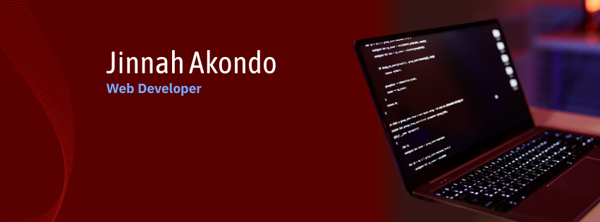

<!-- ================== Banner ================== -->

  

 

<!-- ================== GitHub Streak ================== -->

  

 

<!-- ================== Name & Designation ================== -->
<h1 align="center">MD Jinnah Akondo</h1>
<h3 align="center">Full Stack Web Developer</h3>

---

<!-- ================== About Me ================== -->
### 👋 About Me
I am a passionate Full Stack Web Developer from Bangladesh.  
I love building modern, responsive, and user-friendly web applications.  
Currently focusing on JavaScript, React, and Next.js.  
Always eager to learn new technologies and improve my skills.

---

<!-- ================== Current Activities ================== -->
### 🔭 Current Activities
- 🌱 Exploring **Next.js**
- 💻 Working on a **Tourism Website**
- 📚 Preparing for **Web Developer interviews**

---

<!-- ================== Skills ================== -->
### 🖥️ Frontend

  

### ⚙️ Backend

  

### 🛠️ Tools

  

---

<!-- ================== Social Links ================== -->
### 🔗 Connect With Me

  <a href="https://linkedin.com/in/yourusername" target="_blank">LinkedIn</a> | 
  <a href="https://github.com/jinnahakondo" target="_blank">GitHub</a>

---

<!-- ================== GitHub Stats ================== -->

  

  

